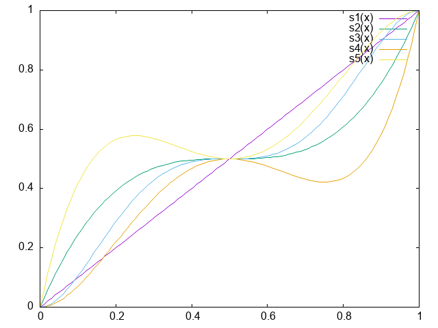

# Löwdin-Shull

In practice the Löwdin-Shull terms are important to ensure that the
energy raises fast enough when bonds are being broken. These
terms are characterised by occupation dependent weights like
$\left(d^\alpha_i d^\beta_i\right)^{1/2}$.

When combining these terms with corelation approaches two problems
arise:
- Near $0$ the Löwdin-Shull factors rise very quickly, but the correlation
  contributions have to rise gently to not over estimate correlation
  effects. The result is the Löwdin-Shull terms overwhelm the
  correlation effects.
- Near $\textonehalf$ the correlation contributions reach their maximum, but
  the Löwdin-Shull terms are still steadily rising. This leads to the
  total energy still climbing gently long beyond a bond distance where
  the bond should have been broken.

To address this we'll introduce "schlenker" functions. To do this let's
first rewrite the Löwdin-Shull weights as
$\left(s\left(d^\alpha_i\right) s\left(d^\beta_i\right)\right)^{p_{ls}}$
where $p_{ls}$ is the Löwdin-Shull power which originally is $1/2$ but now
could be something else, and $s$ is the schlenker function which
originally is just $s(x)=x$. We'll refer to the original schlenker function
as $s1$.

## $s2$: fixing the bond dissociation limit

The $s1$ schlenker function leads to a steady rise of the repulsive terms
around occupation numbers of a half. The correlation energy terms reach
their maximum at that point. The observed gradual rise in the total energy
might be associated with this. So it would seem that a better schlenker
function would be one that has a zero gradient at half occupation.
So we would like a schlenker function that satisfies the constraints:
- [1] $s(0) = 0$
- [2] $s(1) = 1$
- [3] $s(1/2) = 1/2$
- [4] $s'(x)|_{x=1/2} = 0$

suppose
- $s(x) = a x + b x^2 + c x^3$ this satisfies [1]
- [2] is satisfied if $a + b + c = 1$
- [3] is satisfied if $1/2 a + 1/4 b + 1/8 c = 1/2$
- $s'(x) = a + 2 b x + 3 c x^2$
- [4] is satisfied if $a + b + 3/4 c = 0$

These constraints define a linear system of equations
the solution of which is
- $a = +3$
- $b = -6$
- $c = +4$

The resulting function is refered to as $s2$ and is given by
$s2(x) = 3 x - 6 x^2 + 4 x^3$

## $s3$: also fixing the equilibrium bond distance

In addition to the issues in the bond dissociation limit the equilibrium
bond distance has its own issues. For many molecules the correlation energy
at that geometry is small. That means that the correlation energy has to increase
modestly as the occupation numbers move away from zero. The original Löwdin-Shull
contributions on the other hand rise steeply and have a tendency to overwhelm
the correlation terms. To counter that we can try a schlenker function that
satisfies the constraints of $s2$ but in addition also has zero gradients at
$x=0§ and $x=1$. This gets us the following constraints:
- [1] $s(0) = 0$
- [2] $s(1) = 1$
- [3] $s(1/2) = 1/2$
- [4] $s'(x)|_{x=0} = 0$
- [5] $s'(x)|_{x=1/2} = 0$
- [6] $s'(x)|_{x=1} = 0$

suppose
- $s(x) = a x^2 + b x^3 + c x^4 + d x^5$ this satisfies [1] and [4]
- [2] is satisfied if $a+b+c+d=1$
- [3] requires that $1/4 a + 1/8 b + 1/16 c + 1/32 d = 1/2 $
- $s'(x) = 2 a x + 3 b x^2 + 4 c x^3 + 5 d x^4$
- [5] requires that $a + 3/4 b + 1/2 c  + 5/16 d = 0$
- [6] requires that $2 a + 3 b + 4 c + 5 d = 0$

Solving this gives
- $a = +15$
- $b = -50$
- $c = +60$
- $d = -24$

The resulting function is referred to as $s3$ and is
$s3(x) = 15 x^2 - 50 x^3 + 60 x^4 - 24 x^5$

## Visualising schlenker functions

Above we listed and developed in total 3 schlenker functions,
$s1$, $s2$, and $s3$. The image below shows what they look
like.

